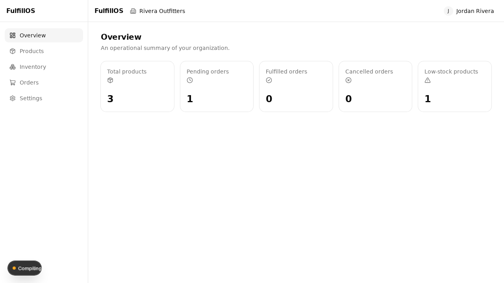
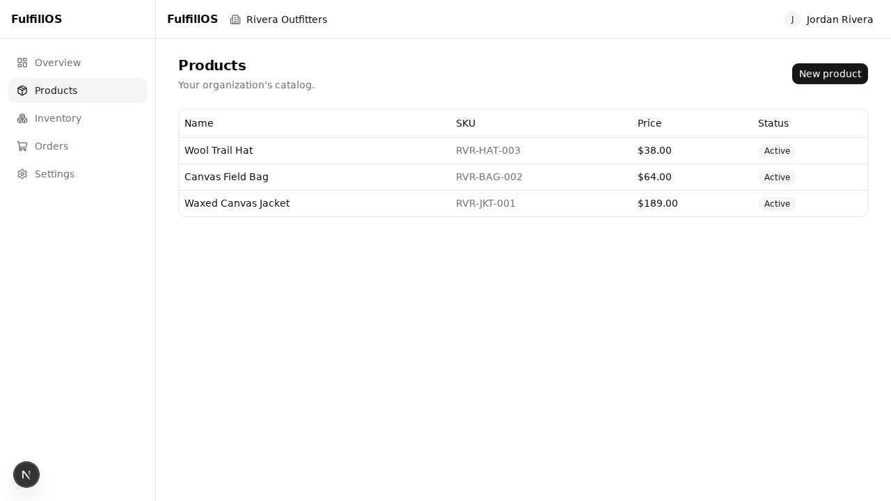
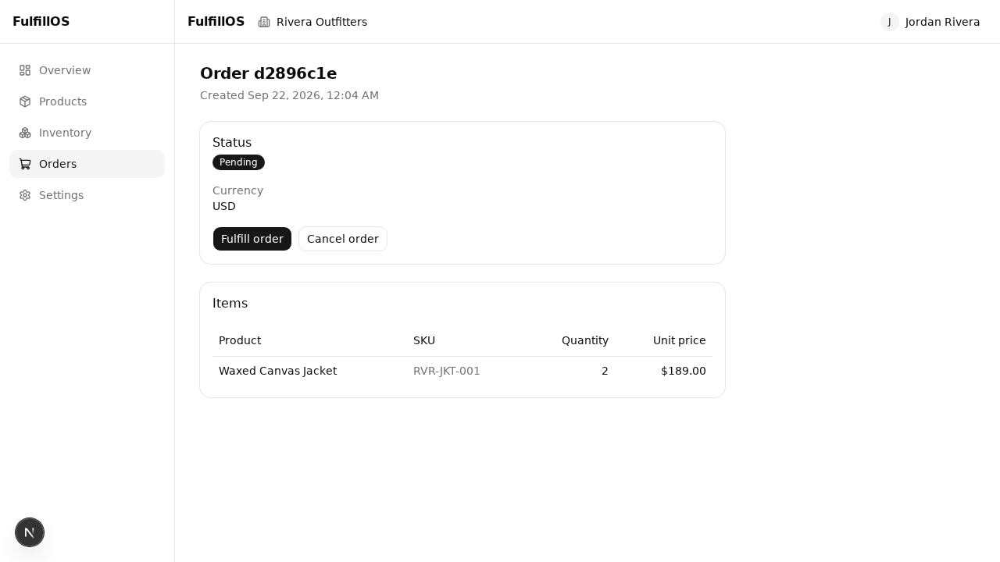

# FulfillOS

A multi-tenant inventory and order management platform. Organizations manage their own products, stock, staff, and customer orders through a shared application with strict tenant isolation.

## Status

**Milestones 0–5 complete** (repository foundation; domain and database engineering;
authentication, sessions, and multi-tenant authorization; the transactional inventory and
reservation engine; the product catalog and order fulfillment workflow; a full enterprise
dashboard frontend integrated with the real API). This README describes what is actually
implemented today, not the full target feature set. See [Known limitations](#known-limitations)
below and the milestone plan in the project brief for what's next.

Implemented so far:

- pnpm workspace with `apps/api` (NestJS) and `apps/web` (Next.js)
- API health endpoints (`GET /health`, `GET /health/ready` — the latter checks database connectivity)
- Docker Compose services for local PostgreSQL and Redis, including a separate database — and, as of Milestone 3, a distinct, non-superuser role with no access to the development database — for integration tests
- Full database schema (organizations, users, memberships, products, inventory, inventory movements, orders, order items, idempotency keys, audit log, sessions) with tenant-isolation constraints, migrations, and an idempotent seed script — see [docs/architecture/database.md](docs/architecture/database.md)
- Database-backed session authentication (Argon2id password hashing, session-bound CSRF tokens, idle/absolute session expiration, Redis-backed rate limiting on auth endpoints), and organization membership/role authorization — see [docs/architecture/authentication.md](docs/architecture/authentication.md)
- A concurrency-safe inventory and reservation engine (stock adjustments, atomic multi-product reservations with row-level locking in deterministic order, transactional request idempotency, and reservation release/cancellation) — see [docs/architecture/inventory.md](docs/architecture/inventory.md)
- A tenant-scoped product catalog (creation with atomic inventory initialization, paginated listing and retrieval) and an order management API (paginated listing/retrieval, transactional fulfillment consuming a reservation, and order-centric cancellation reusing the existing release logic) — see [docs/architecture/order-lifecycle.md](docs/architecture/order-lifecycle.md)
- A tenant-scoped, database-aggregated dashboard summary endpoint (total products, pending/fulfilled/cancelled order counts, low-stock product count)
- OpenAPI/Swagger documentation of the running API at `/api/docs`
- A complete Next.js enterprise dashboard (registration, login, logout, organization switching, an operational overview, product creation and browsing, inventory viewing and adjustment, multi-line order creation/reservation, order fulfillment and cancellation) calling the real API throughout — no mocked business data, no fabricated analytics — see [docs/architecture/frontend.md](docs/architecture/frontend.md)
- PostgreSQL integration tests (schema constraints/tenant isolation, and concurrency/idempotency/rollback tests against real concurrent connections, including the catalog/fulfillment/cancellation engine and the dashboard aggregate endpoint) and a separate HTTP-level security test suite (credentials, sessions, CSRF, tenancy, rate limiting, and the inventory/reservation/catalog/order/dashboard endpoints, plus a full end-to-end business-workflow test) against a real database and real Redis
- Frontend component tests (Vitest + React Testing Library) for form validation, the idempotency-key hook, pagination, confirmation dialogs, and the organization switcher, and a Playwright browser suite covering registration/auth, the full product→reservation→fulfillment workflow, cancellation, role-based permission enforcement, tenant data isolation across organization switches, and failure handling (insufficient stock, invalid input, duplicate submission, expired sessions) — see [docs/architecture/frontend.md#testing](docs/architecture/frontend.md#testing)
- Shared TypeScript/lint/format config, CI pipeline (install, format check, lint, typecheck, unit tests, PostgreSQL integration tests, security tests, frontend component tests, production builds, Playwright browser tests)

Not yet implemented: order fulfillment beyond the single `pending → fulfilled` transition (no
payments, shipping, or partial fulfillment), product update/archive endpoints, organization
invitations, account recovery. See the [architecture overview](docs/architecture/overview.md)
for the target design.

## Screenshots

Captured from the running application against real data (see
[docs/architecture/frontend.md](docs/architecture/frontend.md) for what each page does):

| Overview                                             | Products                                        | Order detail                                       |
| ---------------------------------------------------- | ----------------------------------------------- | -------------------------------------------------- |
|  |  |  |

## Technology stack

| Component        | Technology                        |
| ---------------- | --------------------------------- |
| Language         | TypeScript (strict mode)          |
| Backend          | NestJS                            |
| Frontend         | Next.js (App Router)              |
| UI               | Tailwind CSS, shadcn/ui           |
| Database         | PostgreSQL                        |
| ORM              | Drizzle ORM                       |
| Cache / jobs     | Redis, BullMQ (added when needed) |
| Package manager  | pnpm workspaces                   |
| Backend testing  | Jest                              |
| Frontend testing | Vitest, React Testing Library     |
| E2E testing      | Playwright                        |
| API docs         | OpenAPI / Swagger                 |
| Containers       | Docker, Docker Compose            |
| CI/CD            | GitHub Actions                    |

## Architecture

See [docs/architecture/overview.md](docs/architecture/overview.md) for the system diagram and domain boundaries, [docs/architecture/database.md](docs/architecture/database.md) for the schema/ER diagram/tenant-isolation strategy, [docs/architecture/authentication.md](docs/architecture/authentication.md) for the auth/session/CSRF/authorization design and threat model, [docs/architecture/inventory.md](docs/architecture/inventory.md) for the inventory/reservation engine (transaction boundaries, lock order, idempotency, reservation lifecycle), [docs/architecture/order-lifecycle.md](docs/architecture/order-lifecycle.md) for the product catalog and order fulfillment/cancellation workflow, [docs/architecture/frontend.md](docs/architecture/frontend.md) for the Next.js dashboard (Server/Client boundaries, the API client, auth/CSRF integration, tenant-data isolation across organization switches, state management, testing, and accessibility), and [docs/adr/](docs/adr/) for the architecture decision records:

- [ADR-001: Modular Monolith Architecture](docs/adr/0001-modular-monolith.md)
- [ADR-002: PostgreSQL Inventory Consistency](docs/adr/0002-postgres-inventory-consistency.md)
- [ADR-003: Multi-Tenant Authorization](docs/adr/0003-multi-tenant-authorization.md)
- [ADR-004: CSRF via Session-Bound Synchronizer Token](docs/adr/0004-csrf-session-bound-synchronizer-token.md) (supersedes ADR-003's CSRF detail)

## Prerequisites

- Node.js 20+ (developed against Node 22)
- pnpm 9+ (developed against pnpm 11.6.0)
- Docker and Docker Compose

## Local setup

```bash
# 1. Install dependencies
pnpm install

# 2. Copy environment variables
cp .env.example .env

# 3. Start Postgres (with a separate integration-test database, owned by its own distinct
#    non-superuser role with no access to the development database — see
#    docker/postgres-init/01-create-test-db.sh) and Redis
docker compose up -d

# 4. Apply database migrations
pnpm --filter @fulfillos/api db:migrate

# 5. (optional) Seed a fictional organization, products, and inventory
pnpm --filter @fulfillos/api db:seed

# 6. Run the API (http://localhost:3001)
pnpm dev:api

# 7. Run the web app (http://localhost:3000)
pnpm dev:web

# 8. Visit http://localhost:3000/register to create an account and organization
```

### Demonstration walkthrough

Once both dev servers are running, a full path through the dashboard:

1. Register at `/register` (creates a user, an organization, and an owner membership) — you're
   redirected to `/dashboard/overview`.
2. Create a product at `/dashboard/products/new`, including an initial on-hand quantity.
3. Check `/dashboard/inventory` — the new product's on-hand/reserved/available figures, and
   (owner only) an "Adjust" control.
4. Create an order at `/dashboard/orders/new`: add the product as a line, submit, and land on
   the new order's detail page with status `Pending`.
5. Revisit `/dashboard/inventory` — the reserved and available figures reflect the reservation.
6. From the order's detail page, fulfill or cancel it; inventory updates again accordingly.
7. From the header, use the organization switcher (once you belong to more than one
   organization) or the user menu to rename the organization or log out.

## Environment variables

See [.env.example](.env.example) for the full list with defaults. Never commit a real `.env` file.

## Database migrations

Managed with drizzle-kit; migration SQL is committed to `apps/api/drizzle/`. See [docs/architecture/database.md](docs/architecture/database.md#migration-procedures) for the full workflow. Quick reference:

```bash
# After changing a schema file in apps/api/src/database/schema/, generate a migration
pnpm --filter @fulfillos/api db:generate

# Apply pending migrations to the dev database (DATABASE_URL)
pnpm --filter @fulfillos/api db:migrate

# Apply pending migrations to the integration test database (DATABASE_URL_TEST)
pnpm --filter @fulfillos/api db:migrate:test
```

## Tests

```bash
pnpm test        # unit tests, all workspaces
pnpm lint         # lint, all workspaces
pnpm typecheck    # type check, all workspaces
pnpm format:check # formatting check

# PostgreSQL integration tests (schema constraints, tenant isolation, and the inventory/
# reservation/fulfillment engine's concurrency, idempotency, and rollback guarantees against
# real, concurrently-connected Postgres — requires DATABASE_URL_TEST to point at a real,
# disposable database whose name contains "test", ideally under its own distinct role as
# provisioned by docker compose; the test harness re-verifies the live connection's database
# identity before every destructive operation)
pnpm --filter @fulfillos/api test:integration

# HTTP-level security tests: credentials, sessions, CSRF, tenancy, rate limiting, the
# inventory/reservation/catalog/order/dashboard endpoints (cross-tenant access, role
# enforcement, CSRF, the required Idempotency-Key header), and a full end-to-end
# business-workflow test (requires DATABASE_URL_TEST and REDIS_URL_TEST — see .env.example)
pnpm --filter @fulfillos/api test:security

# Frontend component tests (Vitest + React Testing Library) — form validation, idempotency-key
# stability, pagination, confirmation dialogs, the organization switcher
pnpm --filter @fulfillos/web test

# Playwright browser tests — auth, the full product/reservation/fulfillment workflow,
# cancellation, permission enforcement, tenant isolation across organization switches, and
# failure handling. Launches its own API + web server instances against an isolated test
# database (docker compose up -d must already be running; see
# docs/architecture/frontend.md#testing) — it does not require pnpm dev:api/dev:web to be
# running first.
pnpm --filter @fulfillos/web test:e2e
```

## API documentation

Generated OpenAPI/Swagger UI is served by the running API at `http://localhost:3001/api/docs`
(raw document at `/api/docs-json`) once `pnpm dev:api` is running. See
[docs/architecture/authentication.md](docs/architecture/authentication.md#api-endpoints) for
the auth/organizations endpoints, [docs/architecture/inventory.md](docs/architecture/inventory.md#api)
for the inventory/reservation endpoints, and
[docs/architecture/order-lifecycle.md](docs/architecture/order-lifecycle.md#api) for the
catalog/order endpoints, each including example requests.

## Known limitations

- No order fulfillment beyond the single `pending → fulfilled` transition — no payments, shipping, or partial fulfillment. See [Known limitations in order-lifecycle.md](docs/architecture/order-lifecycle.md#known-limitations) for the full list.
- No product update or archive/reactivate endpoint (the `product_status` enum exists in the schema but nothing changes it yet).
- No organization invitation flow, account recovery, or email verification — see [Known limitations in authentication.md](docs/architecture/authentication.md#known-limitations) for the full list and reasoning.
- No Content-Security-Policy or systematic output-encoding audit on the frontend.
- `audit_log`'s append-only nature is an application convention, not yet a database-enforced guarantee (no restricted database role exists yet).
- No automated accessibility (axe) scanning is wired into Playwright yet; see [Accessibility in frontend.md](docs/architecture/frontend.md#accessibility) for exactly what was manually verified instead.
- The order-creation product picker fetches up to 100 products once rather than a searchable, paginated combobox — see [Known limitations in frontend.md](docs/architecture/frontend.md#known-limitations).
- No product edit/archive/delete UI, matching the backend, which doesn't expose those endpoints yet.

## Future improvements

Tracked as GitHub Issues once the repository and issue tracker are fully set up (see project brief milestones 1–6).
