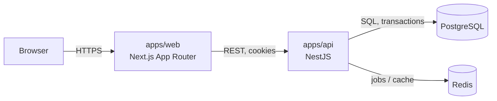
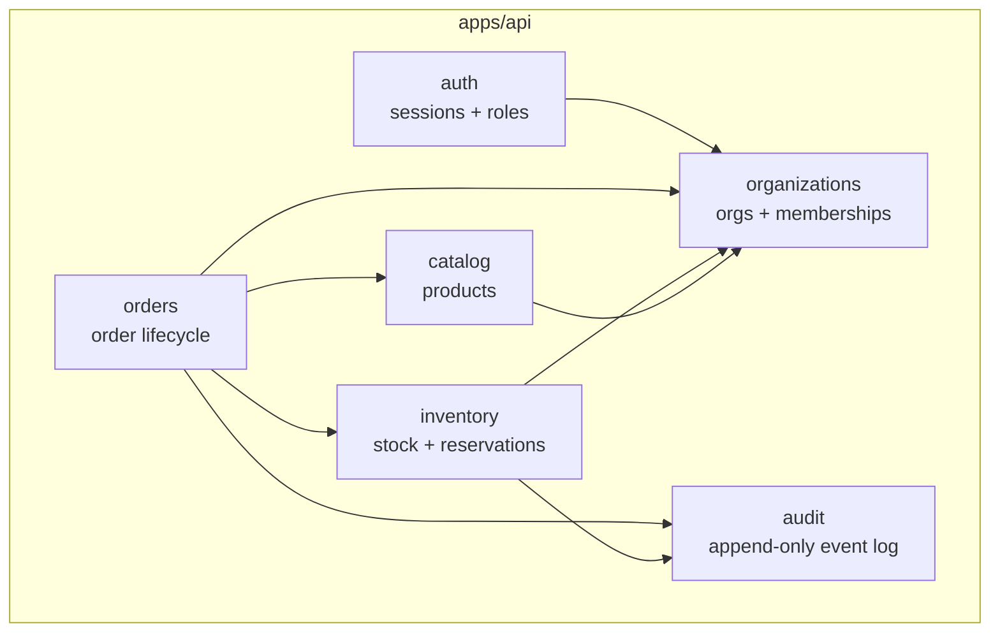

# Architecture Overview

## Status

This document describes the target architecture for the MVP. As of Milestone 0, only the workspace scaffolding, health endpoints, and tooling described below are actually implemented — domain modules (organizations, auth, catalog, inventory, orders, audit) are not yet built. See the root README's "Known limitations" section for current status.

## System context

## Modular monolith: domain boundaries inside apps/api

Each module owns its own controllers, services, and persistence access, and is only reached through the providers it exports. See [ADR-001](../adr/0001-modular-monolith.md) for the reasoning behind this boundary.

## Inventory consistency

Inventory correctness (preventing overselling under concurrent orders) is the project's central technical challenge. The concurrency-control strategy — row-level locking, deterministic lock ordering, and database-enforced idempotency — is documented in [ADR-002](../adr/0002-postgres-inventory-consistency.md).

## Multi-tenancy and authorization

Tenant isolation and the session-based auth strategy are documented in [ADR-003](../adr/0003-multi-tenant-authorization.md).
